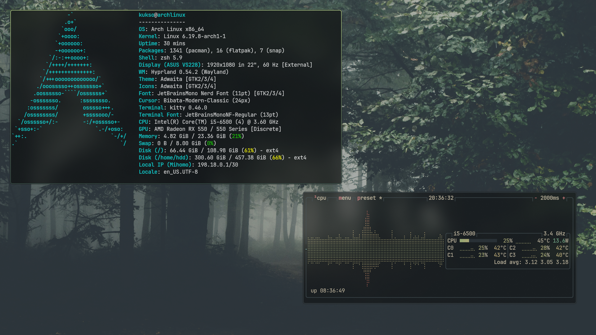

# kukso-hypr-dots

# Features:
- Modular config structure
- Dracula & Everforest color scheme
- Dwindle layout with smooth animations
- Built-in screenshot system (Grim/Slurp)
- Multi-language support (US/RU)

# Installation:
**Arch:**
- `sudo pacman -S hyprland kitty rofi-wayland swww mako grim slurp wl-clipboard polkit-kde-agent ttf-jetbrains-mono-nerd`
- `git clone https://github.com/Kuksoo/kukso-hypr-dots/ ~/.config/hypr`
- If you want use my browser, telegram client and file manager:
- `paru -S yazi zen-browser telegram-desktop`

# Programs:
- Terminal: `kitty`
- File Manager: `yazi`
- Launcher: `rofi`
- Browser: `zen-browser`
- Notifications: `mako`
- Wallpaper: `swww`

# Dependencies:
- System: `hyprland`, `wayland`, `dbus`, `brightnessctl`, `playerctl`
- Fonts: `JetBrainsMono Nerd Font`
- Cursor: `Bibata-Modern-Classic`

# Keybinds:
- **MainMod:** `SUPER` (Windows key)
- **Terminal:** `[SUPER] + Q`
- **Launcher:** `[SUPER] + R`
- **Close Window:** `[SUPER] + C`
- **File Manager:** `[SUPER] + E`
- **Move Focus:** `[SUPER] + H/J/K/L`
- **Screenshot:** `Print` (Full) / `CTRL + Print` (Area)
